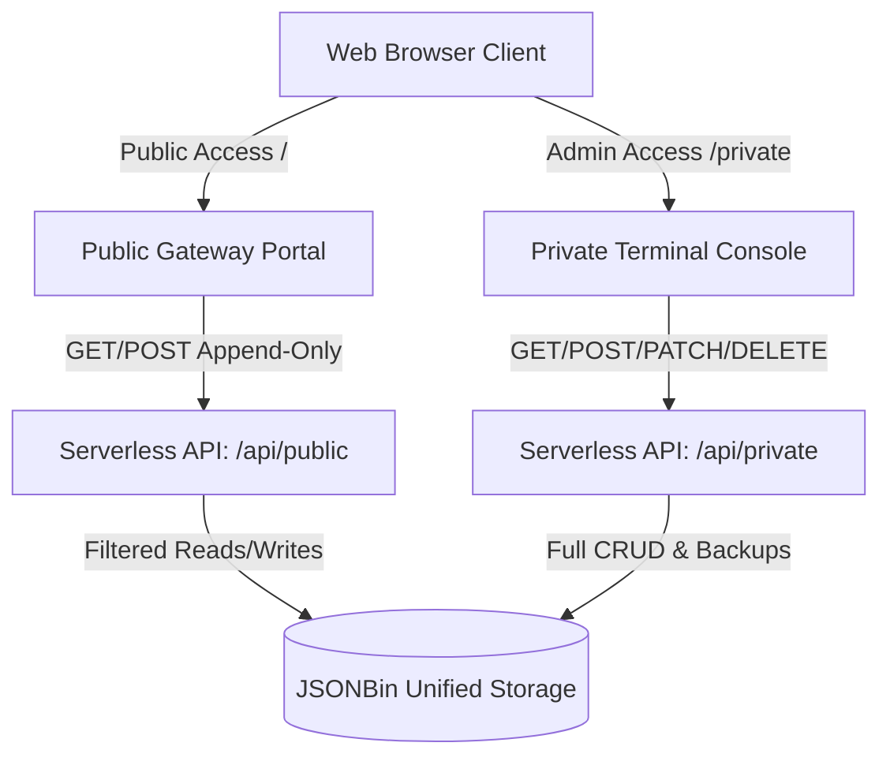

# VenSync

VenSync is a secure, real-time synchronization console and collaborative dashboard built on a decoupled serverless architecture. Engineered for low-latency communication and task tracking, it delivers a seamless, offline-first Progressive Web App (PWA) experience across public gateway portals and authenticated private control terminals.

---

## Architecture Overview

VenSync physically segregates user roles and views to prevent administrative bypasses and keep private configurations secure.

### 1. Isolated View Gateways
* **Public Gateway (`/`)**: Rendered dynamically via serverless function. It serves a fully self-contained HTML page containing all stylesheet design tokens and script modules. Public readers can search, filter channels, read public-tagged cards, and submit new public cards. Administrative panels, edit capabilities, and delete functions are entirely absent from the served markup.
* **Private Console (`/private`)**: Accessed securely through the private terminal layout. Once authenticated, users can manage all classifications, modify task status parameters, toggle card visibility tags, edit notes, restore database backups, and delete cards.

### 2. Guarded Serverless APIs
* `/api/public.js`: First validates server-side category and access switches. Only reads cards tagged with a public visibility parameter and restricts uploads to safe, append-only structures.
* `/api/private.js`: Requires an authenticated master passcode header to process paginated lists, card editing patches, secure database backups, and record deletions.

### 3. Progressive Offline Sync
* **Service Worker Caching**: Utilizes offline network-first service worker intercepts to cache essential templates and system resources.
* **Muted Pending Queues**: Offline inputs are queued locally and rendered in the feed using a WhatsApp-like pending style (greyed italics with a pending queue label).
* **Connection Re-establishment**: The client automatically registers native connection listeners and pushes queued cards to the backend database chronologically upon internet recovery.

---

## Core Capabilities

* **Accents Themes**: Dynamic accent transformations between blue (chat mode) and green (task states filter) with no purple or pink gradients.
* **Interactive Dialogs**: All system interactions—including channel creations, file attachments, and deletion confirmations—occur within in-app modal overlays.
* **Autolock Inactivity Grace Period**: Employs a 120-second (2-minute) visibility grace period, preventing instant session lockouts on brief tab changes.
* **Cloud Attachment Warnings**: Prompt-free file selection and drag-drop inputs warn users before storing sensitive credentials on cloud bins.
* **Card Mention Tagging**: Text matches of `[Card: Title](id)` are rendered as interactive pill badges that display card details upon click.

---

## Environment Variables

Register your terminal on Vercel and define the following variables:

1. `MASTER_PASSWORD` — Alphanumeric passphrase to unlock the Private Sudo Console.
2. `JSONBIN_ID` — Target database bucket ID on JSONBin.io.
3. `JSONBIN_KEY` — API master key on JSONBin.io (`X-Master-Key`).
